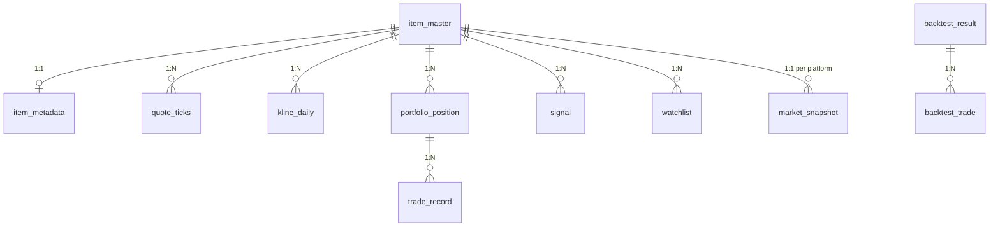

# CSQuant 数据库设计（DATABASE_SCHEMA）

> 依据：指示文档第 6/16 节、`DATA_SOURCE_SPEC.md`、`04_ID_Mapper_analysis.md`、`05_CSGO_API_analysis.md`。
> DDL 以 SQLite（WAL）为 V1 方言，避免方言专有特性，预留 PostgreSQL/TimescaleDB 迁移（Alembic）。

---

## 1. 设计原则

1. **时间戳**：一律 TEXT，ISO8601 UTC（`2026-07-21T08:00:00Z`）。展示层转 UTC+8。
2. **价格**：V1 用 REAL（双精度足够覆盖饰品分位精度），每字段配 `currency`（CNY/USD）；迁 PG 时改 NUMERIC(18,4)。
3. **缺失 = NULL**，禁止置 0；行情记录带 `data_quality`（A/B/C/D）+ `quality_flags`（JSON 数组）。
4. **item_master 主键** `item_uuid`（TEXT UUID）；`(app_id, market_hash_name)` 唯一逻辑键。
5. **信号可追溯**：`signal.input_snapshot_ref` 指向当时输入快照。
6. **流水不可变**：`trade_record`/`signal`/`quote_ticks` 只插不改（审计）。

## 2. ER 图



## 3. 完整 DDL

```sql
PRAGMA journal_mode = WAL;

-- 3.1 饰品身份与跨平台映射（ID-Mapper 初始化）
CREATE TABLE IF NOT EXISTS item_master (
    item_uuid        TEXT PRIMARY KEY,            -- UUID
    app_id           INTEGER NOT NULL DEFAULT 730,
    market_hash_name TEXT NOT NULL,               -- 跨平台唯一关联键（英文）
    name_zh          TEXT,
    name_en          TEXT,
    category         TEXT,                        -- knife/glove/rifle/pistol/case/sticker/...
    is_stattrak      INTEGER NOT NULL DEFAULT 0,
    is_souvenir      INTEGER NOT NULL DEFAULT 0,
    steam_name_id    INTEGER,                     -- steam name_id（itemordershistogram 用）
    buff_id          INTEGER,
    c5_id            TEXT,                        -- 超 JS 安全整数，按字符串存
    igxe_id          INTEGER,
    uuyp_id          INTEGER,
    csqaq_good_id    INTEGER,
    created_at       TEXT NOT NULL,
    updated_at       TEXT NOT NULL,
    UNIQUE (app_id, market_hash_name)
);

-- 3.2 元数据（CSGO-API 同步；与 master 分表：3.4 万行映射轻量、元数据按需补充）
CREATE TABLE IF NOT EXISTS item_metadata (
    item_uuid     TEXT PRIMARY KEY REFERENCES item_master(item_uuid),
    weapon        TEXT,
    skin          TEXT,
    wear          TEXT,                           -- Factory New / ...
    rarity        TEXT,
    rarity_color  TEXT,
    collection    TEXT,
    crate         TEXT,
    phase         TEXT,                           -- Doppler 相位
    min_float     REAL,
    max_float     REAL,
    paint_index   INTEGER,
    def_index     INTEGER,                        -- weapon_id（库存反查用）
    image_url     TEXT,
    extra_json    TEXT,                           -- 其余字段兜底
    updated_at    TEXT NOT NULL
);

-- 3.3 时序行情（核心大表）
CREATE TABLE IF NOT EXISTS quote_ticks (
    id                 INTEGER PRIMARY KEY AUTOINCREMENT,
    ts                 TEXT NOT NULL,             -- 采集时间 UTC
    item_uuid          TEXT NOT NULL REFERENCES item_master(item_uuid),
    platform           TEXT NOT NULL,             -- BUFF/UUYP/STEAM/C5/IGXE/ECO
    source             TEXT NOT NULL,             -- csqaq/steamdt/steam
    sell_price         REAL,
    sell_count         INTEGER,
    buy_price          REAL,                      -- 最高求购价
    buy_count          INTEGER,
    volume_24h         INTEGER,
    reference_price    REAL,
    currency           TEXT NOT NULL DEFAULT 'CNY',
    source_update_time TEXT,
    data_quality       TEXT NOT NULL DEFAULT 'A',
    quality_flags      TEXT NOT NULL DEFAULT '[]'
);
CREATE INDEX IF NOT EXISTS idx_ticks_item_ts ON quote_ticks(item_uuid, platform, ts DESC);
CREATE INDEX IF NOT EXISTS idx_ticks_ts ON quote_ticks(ts DESC);

-- 3.4 最新快照（独立表而非视图：3.4 万件 × 6 平台下，视图全表扫太慢；采集器 upsert 维护）
CREATE TABLE IF NOT EXISTS market_snapshot (
    item_uuid  TEXT NOT NULL REFERENCES item_master(item_uuid),
    platform   TEXT NOT NULL,
    source     TEXT NOT NULL,
    sell_price REAL, sell_count INTEGER, buy_price REAL, buy_count INTEGER,
    volume_24h INTEGER, reference_price REAL,
    currency   TEXT NOT NULL DEFAULT 'CNY',
    ts         TEXT NOT NULL,
    source_update_time TEXT,
    data_quality TEXT NOT NULL DEFAULT 'A',
    PRIMARY KEY (item_uuid, platform)
);

-- 3.5 K线
CREATE TABLE IF NOT EXISTS kline_daily (
    item_uuid TEXT NOT NULL REFERENCES item_master(item_uuid),
    platform  TEXT NOT NULL,
    period    TEXT NOT NULL DEFAULT '1d',         -- 1h/4h/1d/7d
    ts        TEXT NOT NULL,                      -- K线起点 UTC
    open REAL NOT NULL, close REAL NOT NULL, high REAL NOT NULL, low REAL NOT NULL,
    volume    INTEGER,                            -- SteamDT 为 NULL
    source    TEXT NOT NULL,
    PRIMARY KEY (item_uuid, platform, period, ts)
);

-- 3.6 持仓
CREATE TABLE IF NOT EXISTS portfolio_position (
    position_id TEXT PRIMARY KEY,
    item_uuid   TEXT NOT NULL REFERENCES item_master(item_uuid),
    asset_id    TEXT,                             -- Steam assetid（同饰品多件区分）
    quantity    INTEGER NOT NULL DEFAULT 1,
    buy_price   REAL,                             -- 买入单价（未知为 NULL）
    buy_time    TEXT,
    buy_platform TEXT,
    cost_basis  REAL,                             -- quantity * buy_price（含费）
    status      TEXT NOT NULL DEFAULT 'HOLDING',  -- HOLDING/RENTED/SOLD
    notes       TEXT,
    created_at  TEXT NOT NULL, updated_at TEXT NOT NULL
);
CREATE INDEX IF NOT EXISTS idx_pos_item ON portfolio_position(item_uuid, status);

-- 3.7 交易流水（只插不改）
CREATE TABLE IF NOT EXISTS trade_record (
    trade_id    TEXT PRIMARY KEY,
    position_id TEXT REFERENCES portfolio_position(position_id),
    item_uuid   TEXT NOT NULL,
    side        TEXT NOT NULL,                    -- BUY/SELL
    quantity    INTEGER NOT NULL,
    price       REAL NOT NULL,
    fee         REAL NOT NULL DEFAULT 0,
    platform    TEXT,
    currency    TEXT NOT NULL DEFAULT 'CNY',
    traded_at   TEXT NOT NULL,
    created_at  TEXT NOT NULL
);

-- 3.8 每日净值快照
CREATE TABLE IF NOT EXISTS portfolio_snapshot (
    ts              TEXT PRIMARY KEY,             -- 每日收盘 UTC
    total_value     REAL NOT NULL,
    total_cost      REAL NOT NULL,
    cash            REAL NOT NULL DEFAULT 0,
    unrealized_pnl  REAL NOT NULL,
    realized_pnl    REAL NOT NULL DEFAULT 0,
    return_rate     REAL,                         -- 考虑注资调整后的收益率
    net_deposit     REAL NOT NULL DEFAULT 0,      -- 累计净注资（防收益率污染）
    value_by_platform TEXT,                       -- JSON {BUFF: x, STEAM: y}
    currency        TEXT NOT NULL DEFAULT 'CNY'
);

-- 3.9 大盘指数
CREATE TABLE IF NOT EXISTS market_index (
    id INTEGER PRIMARY KEY AUTOINCREMENT,
    ts              TEXT NOT NULL,
    index_name      TEXT NOT NULL,                -- csqaq_main / steamdt_broad / 自算
    index_value     REAL NOT NULL,
    change_1d REAL, change_7d REAL, change_30d REAL,
    breadth_up INTEGER, breadth_down INTEGER,
    volume_score REAL, liquidity_score REAL, sentiment_score REAL,
    market_score    REAL,                         -- MarketScore 0-100
    market_regime   TEXT,                         -- extreme_fear/bearish/neutral/bullish/extreme_greed
    sub_indices_json TEXT,
    source TEXT NOT NULL
);
CREATE INDEX IF NOT EXISTS idx_index_ts ON market_index(index_name, ts DESC);

-- 3.10 信号（只插不改）
CREATE TABLE IF NOT EXISTS signal (
    id INTEGER PRIMARY KEY AUTOINCREMENT,
    ts TEXT NOT NULL,
    item_uuid TEXT NOT NULL REFERENCES item_master(item_uuid),
    market_score REAL, item_score REAL, final_score REAL,
    signal TEXT NOT NULL,                         -- BUY/HOLD/SELL
    confidence REAL,                              -- 0-1
    risk_level TEXT,                              -- L/M/H
    reason_json TEXT NOT NULL,                    -- 因子分值/权重/贡献/关键原始值
    suggested_position REAL,                      -- 建议仓位比例 0-1
    model_version TEXT NOT NULL,
    input_snapshot_ref TEXT                       -- 输入数据引用（快照ts列表 JSON）
);
CREATE INDEX IF NOT EXISTS idx_signal_item ON signal(item_uuid, ts DESC);

-- 3.11 回测
CREATE TABLE IF NOT EXISTS backtest_result (
    backtest_id TEXT PRIMARY KEY,
    strategy_name TEXT NOT NULL, strategy_version TEXT NOT NULL,
    start_date TEXT NOT NULL, end_date TEXT NOT NULL,
    params_json TEXT NOT NULL,
    total_return REAL, annualized_return REAL, max_drawdown REAL,
    sharpe REAL, sortino REAL, calmar REAL,
    win_rate REAL, profit_factor REAL,
    trade_count INTEGER, turnover REAL,
    fee_cost REAL, slippage_cost REAL,
    benchmark_return REAL,
    created_at TEXT NOT NULL
);
CREATE TABLE IF NOT EXISTS backtest_trade (
    id INTEGER PRIMARY KEY AUTOINCREMENT,
    backtest_id TEXT NOT NULL REFERENCES backtest_result(backtest_id),
    item_uuid TEXT NOT NULL,
    side TEXT NOT NULL, quantity INTEGER NOT NULL,
    price REAL NOT NULL, fee REAL NOT NULL,
    traded_at TEXT NOT NULL
);

-- 3.12 数据源健康
CREATE TABLE IF NOT EXISTS datasource_health (
    id INTEGER PRIMARY KEY AUTOINCREMENT,
    source TEXT NOT NULL, endpoint TEXT NOT NULL, ts TEXT NOT NULL,
    latency_ms INTEGER, status TEXT NOT NULL,     -- ok/degraded/down
    error_code TEXT, success_rate_1h REAL, freshness_p50_sec INTEGER
);

-- 3.13 系统事件/告警
CREATE TABLE IF NOT EXISTS event_log (
    id INTEGER PRIMARY KEY AUTOINCREMENT,
    ts TEXT NOT NULL, level TEXT NOT NULL,        -- INFO/WARN/ERROR/CIRCUIT
    module TEXT NOT NULL, message TEXT NOT NULL, detail_json TEXT
);

-- 3.14 自选池与采集优先级
CREATE TABLE IF NOT EXISTS watchlist (
    item_uuid TEXT PRIMARY KEY REFERENCES item_master(item_uuid),
    tier TEXT NOT NULL DEFAULT 'L2',              -- L1持仓/L2自选/L3全库慢采
    added_at TEXT NOT NULL, notes TEXT
);
```

## 4. 量级估算与保留策略

| 表 | 估算 |
|---|---|
| quote_ticks | 500 件 × 6 平台 × 288 次/日 ≈ 86 万行/日 → 原始保留 7 天 |
| | 降采样任务（每日 02:00）：>7 天 → 小时级（保留 90 天）；>90 天 → 日线并入 kline_daily（永久） |
| kline_daily | 500 件 × 6 平台 ≈ 110 万行/年，可长期保留 |
| market_snapshot | ≤ 3.4 万 × 6 ≈ 20 万行封顶 |
| signal | 500 件 × 2 次/日 ≈ 36 万行/年 |

## 5. 初始化数据来源

1. **item_master**：导入 ID-Mapper `steam/buff/c5/igxe/uuyp` 五平台 `730.json`（34,417 键已对齐）；`-1 → NULL`；c5 值按 TEXT；以 steam 文件为基表 LEFT JOIN。
2. **csqaq_good_id**：运行期经 `get_good_id` 接口按需补录。
3. **item_metadata**：每日同步 CSGO-API `public/api/{en,zh-CN}` JSON（skins/skins_not_grouped/crates/collections…），`market_hash_name` 关联，manifestId 变化才全量。
4. **迁移**：Alembic（`migrations/versions`，每次 schema 变更一个 revision，禁止手改库）。

## 6. 一致性规则落地

- 写入路径统一经 `database/dao.py`，禁止散写 SQL；
- DAO 层强制：UTC 时间、currency 非空、quality 默认值、缺失 None；
- 跨源价格入库前必须过 `data_quality_pipeline`（见 DATA_SOURCE_SPEC §10）。
